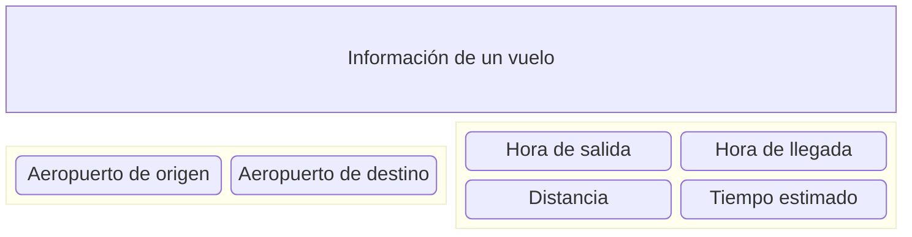

# FlightOnTime✈ (Previsión de retrasos de vuelos)
>Equipo: **H12-25-L-Equipo 15-Data Science**

Introducción

## Descripción general del proyecto: 
El desafío de FlightOnTime es desarrollar una solución predictiva capaz de estimar si un vuelo va a despegar a tiempo o con retraso. Se creará un sistema capaz de estimar la probabilidad de un vuelo para atrasarse o ser puntual. 

### ¿Quienés podrían acceder a este sistema?
>Identificamos nuestro sector de negocio:

>Identificamos a nuestros clientes:

Los retrasos en los vuelos causan **insatisfacción** en los pasajeros, **costos extras** para las aerolíneas y **problemas de logística** para los aeropuertos.

### ¿Como podemos anticipar el retraso en un vuelo?
Es una tarea de predicción, por lo que deberíamos preguntarnos: **¿Con que datos podríamos calcular la probabilidad de que un vuelo se retrase?**

### ¿Cuáles son nuestros objetivos?
1. Que los **aeropuertos** puedan planificar mejor el uso de su infraestructura.
2. Que las **aerolíneas** puedan ajustar la operación y minimizen costos extras.
3. Que los **pasajeros** puedan recibir alertas para planear su llegada al aeropuerto.

### ¿Como podríamos medir la efectividad de nuestro sistema?*

Desarrollo

  
## Desarrollo del proyecto:

### Data Science

### Back-End

